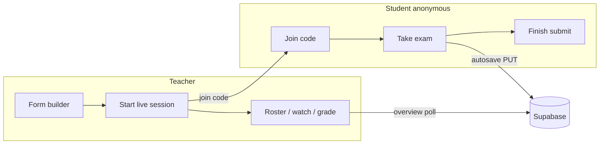
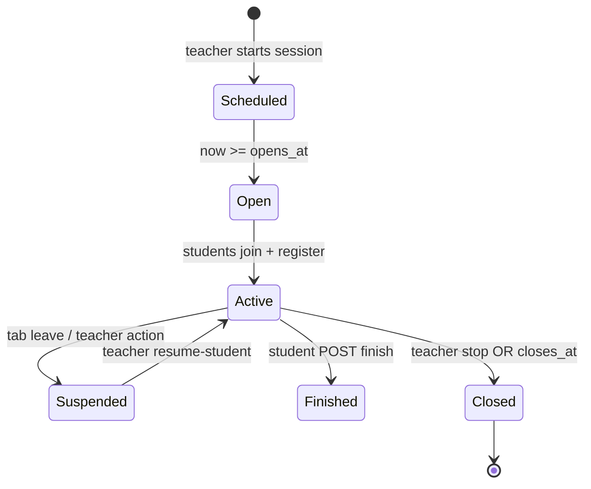
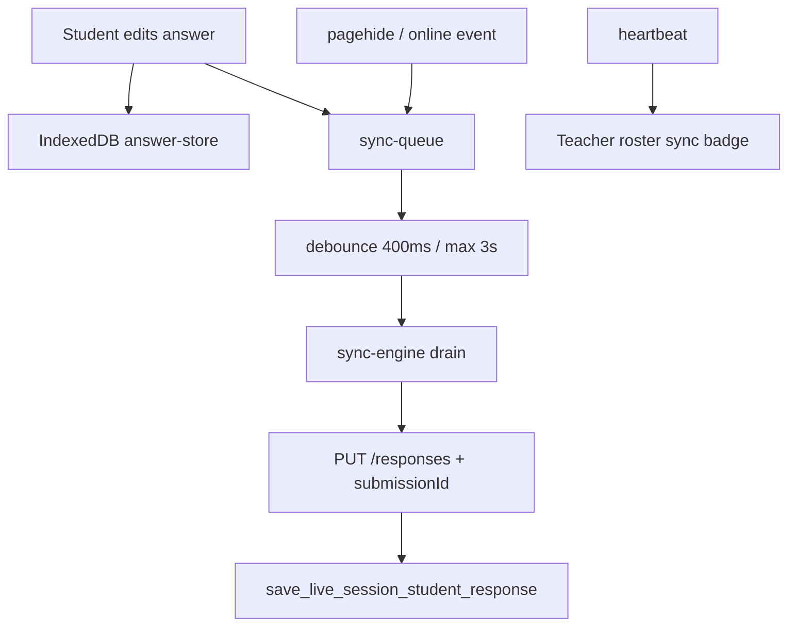

# Truepaper — Feature & Architecture Guide

**Audience:** AI agents and developers working in this repo.  
**Goal:** Fast orientation — what the product does, how flows connect, and where code lives.

> **Maintenance:** When you add, remove, or materially change a feature, API route, migration, env var, or major module, update **this file in the same PR/commit**. See [Keeping this doc current](#keeping-this-doc-current).

---

## Table of contents

1. [Product summary](#product-summary)
2. [Stack & repo layout](#stack--repo-layout)
3. [Auth & identity](#auth--identity)
4. [Teacher features](#teacher-features)
5. [Student features](#student-features)
6. [Live sessions (runtime)](#live-sessions-runtime)
7. [Offline sync & PWA](#offline-sync--pwa)
8. [Question & response types](#question--response-types)
9. [Grading & review](#grading--review)
10. [Template library](#template-library)
11. [i18n, legal, chrome](#i18n-legal-chrome)
12. [Database & migrations](#database--migrations)
13. [API routes](#api-routes)
14. [Key files map](#key-files-map)
15. [Client runtime (hooks, polling, broadcast)](#client-runtime-hooks-polling-broadcast)
16. [Testing](#testing)
17. [Environment variables](#environment-variables)
18. [Deployment notes](#deployment-notes)
19. [Agent conventions & pitfalls](#agent-conventions--pitfalls)
20. [Keeping this doc current](#keeping-this-doc-current)

---

## Product summary

**Truepaper** is a classroom form/exam platform for teachers and anonymous students.

| Role | Auth | Primary UI |
|------|------|------------|
| **Teacher** | Supabase email/password or Google OAuth | `app/[lang]/dashboard/`, builder in `HomeClient.tsx` |
| **Student** | None — browser `deviceId` (UUID in `localStorage`) | `app/[lang]/join/`, exam in `HomeClient.tsx` |

Core loop:

1. Teacher builds a form (questions of many types).
2. Teacher starts a **live session** → 6-character **join code** + time window.
3. Students join with code + display name, answer questions with autosave.
4. Teacher monitors roster, gives live feedback, suspends tab-leavers, grades.
5. Student submits (finish) → teacher grades → optional review share link / PDF.



---

## Stack & repo layout

| Path | Purpose |
|------|---------|
| `app/[lang]/` | Localized pages (en, uk) |
| `app/api/` | Next.js Route Handlers (teacher auth + public student APIs) |
| `app/auth/callback/` | OAuth code exchange |
| `components/` | Shared React UI |
| `lib/` | Domain logic, Supabase clients, offline sync, i18n |
| `messages/` | `en.json`, `uk.json` translation dictionaries |
| `public/` | Static assets, `manifest.json`, `sw.js` (service worker) |
| `supabase/migrations/` | Ordered SQL migrations (source of truth for schema) |
| `supabase/schema.sql` | Greenfield bootstrap (alternative to migrations) |
| `e2e/` | Playwright functional tests |
| `load-tests/` | k6 load test for student sync |
| `proxy.ts` | Locale routing + Supabase session refresh (middleware equivalent) |
| `docs/FEATURES.md` | **This file** |

**Framework notes:** Next.js **16** (App Router), React **19**. Read `node_modules/next/dist/docs/` before assuming Next APIs — this project uses Next 16 conventions (`AGENTS.md`).

---

## Auth & identity

### Teachers

- Cookie session via `@supabase/ssr` — `lib/supabase/server.ts`, refreshed in `proxy.ts`.
- `profiles` table: `role` is `'teacher'` or `'student'`; OAuth signups default to teacher (`20260524100000_oauth_signup_defaults.sql`).
- API routes use `getSessionUser()` from `lib/request-auth.ts`.
- RLS: teachers own `forms` / `questions`; session owner manages live session data.

### Students (anonymous)

- **No login.** UUID v4 stored as `truepaper_anonymous_session_id` in `localStorage` — `lib/anonymous-session.ts`.
- All student writes go through **anon key** + **SECURITY DEFINER RPCs** — `lib/supabase/anon-service.ts`. **No service role key** in the app.
- Display name required (1–120 chars) — `lib/live-session-display-name.ts`.
- **Resume code** (8-char, teacher-issued) re-binds a lost device to the same `deviceId` — `lib/resume-code.ts`.

---

## Teacher features

### Registration & login

- Pages: `app/[lang]/register/page.tsx`, `app/[lang]/login/page.tsx`
- APIs: `POST /api/auth/register`, `login`, `logout`; `GET /api/auth/session`
- Password policy: `lib/password-policy.ts`
- Google OAuth: `components/GoogleSignInButton.tsx` → `/auth/callback`

### Dashboard

- `app/[lang]/dashboard/page.tsx` → `components/dashboard/TeacherDashboard.tsx`
- Running sessions, past sessions, form library sections
- Session list API: `GET /api/teacher/sessions`

### Form builder

- Primary surface: `app/[lang]/HomeClient.tsx` (teacher intent / mode)
- CRUD: `GET/POST /api/forms`, `PATCH/DELETE /api/forms/[formId]`
- Questions: `POST /api/forms/[formId]/questions`, `PATCH/DELETE /api/questions/[questionId]`
- Response type config UI: `components/response-types/BuilderResponseConfig.tsx`
- Unsaved builder state: `lib/pending-builder-form.ts`

### Start & manage live sessions

- Start: `POST /api/forms/[formId]/live-sessions` → creates `form_sessions` row + 6-char join code
- Session page: `app/[lang]/dashboard/sessions/[liveSessionId]/page.tsx`
- Overview/roster: `GET /api/forms/live-sessions/[liveSessionId]/overview`
- Stop early (finish all): `POST .../stop`
- Delete closed session: `DELETE .../`
- Join share UI: `components/SessionJoinShare.tsx`
- Public projector board (no answers): `app/[lang]/live/[joinCode]/page.tsx` + `GET /api/public/live-board`

### Monitor students

- Roster: `components/SessionExamRoster.tsx` — presence, typing, sync badges, suspensions, hand raises
- Watch one student: `app/[lang]/dashboard/sessions/[liveSessionId]/watch/[deviceId]/page.tsx`
- Snapshot API: `GET .../participants/[deviceId]/exam-snapshot`
- Live feedback: `PATCH .../participants/[deviceId]/live-feedback`
- Structured feedback keys: `PATCH .../participants/[deviceId]/feedback-key`

### Suspensions & tab leave

- Student leaving tab → `POST /api/public/live-sessions/[id]/tab-leave` → `suspended_at` set
- Teacher clears: `POST .../resume-student`
- Client: `lib/exam-tab-leave.ts`, `lib/student-exam-tab-pause.ts`

### Rejoin codes

- Teacher creates: `POST .../participants/[deviceId]/rejoin-code`
- UI: `components/TeacherStudentRejoinShare.tsx`
- Student lookup: `GET /api/public/resume?code=`
- Rejoin blocked after submit (`20260519100000_block_rejoin_after_submit.sql`)

### Grading & PDFs

- Manual grades: `PATCH .../participants/[deviceId]/grades`
- Mark complete: `POST .../participants/[deviceId]/mark-graded`
- Single PDF: `GET .../participants/[deviceId]/exam-pdf`
- Bundle PDF: `GET .../exam-bundle-pdf`
- Logic: `lib/exam-grades.ts`, `lib/exam-pdf.ts`

### Review share links

- Create: `POST .../participants/[deviceId]/review-link`
- Public read: `GET /api/public/review/[token]` → `app/[lang]/review/[token]/page.tsx`

### Template library

- Browse: `app/[lang]/dashboard/templates/page.tsx`
- APIs under `app/api/library/` — templates, org settings, clone to form
- Domain: `lib/library/`

---

## Student features

### Join exam

1. Enter 6-char join code at `app/[lang]/join/page.tsx` (or deep link).
2. `GET /api/public/join?code=` → session + form + questions.
3. Enter display name → `POST /api/public/live-sessions/[id]/register`.
4. Exam UI loads in `HomeClient.tsx`.

### Take exam

- One question component per type: `components/StudentExamQuestion.tsx` → `StudentResponseDispatcher.tsx`
- **Autosave:** debounced PUT to `/api/public/live-sessions/[id]/responses` with optional `submissionId` (idempotent).
- **State poll** every 3s: suspend, finish, hand-raise, window — `lib/use-student-exam-state-poll.ts` → `GET .../state`.
- **Heartbeat:** typing + offline sync metadata — `POST .../heartbeat`.
- **Live teacher feedback:** polled — `GET .../feedback`.
- **Raise hand:** `POST .../raise-hand` — `components/RaiseHandButton.tsx`.
- **Connection UI:** `components/ConnectionIndicator.tsx`, `components/StudentAutosaveBanner.tsx`.

### Resume after device loss

- Teacher gives 8-char resume code.
- `GET /api/public/resume?code=` restores `deviceId` + session.
- Answers merged from server + IndexedDB on load — `lib/student-exam-answer-hydration.ts`, `lib/offline/answer-store.ts`.

### Submit (finish)

- Button calls `submitExam()` in `HomeClient.tsx`:
  1. `PUT .../responses` (authoritative final save + `submissionId`)
  2. `POST .../finish` (sets `finished_at`, triggers MC autograde)
- **Requires network.** Offline submit fails with timeout/error — **not queued**.
- After success → `app/[lang]/join/submitted/page.tsx`.

### What students cannot do

- List/browse forms publicly (`GET /api/public/forms` → 410).
- Use legacy per-form response API (`/api/public/forms/[formId]/responses` → 410).
- Rejoin after successful submit.
- Finish exam while session window is closed (`finish_live_session_student_response` checks `opens_at`/`closes_at`).

---

## Live sessions (runtime)

### Codes

| Code | Length | Charset | Created by | Lookup |
|------|--------|---------|------------|--------|
| Join | 6 | Crockford base32 | Session start | `GET /api/public/join` |
| Resume | 8 | Crockford base32 | Teacher per student | `GET /api/public/resume` |

### Session lifecycle



### Presence & roster status

- High-frequency data in `live_session_presence` (since `20260530090000_scale_polling_presence.sql`).
- Heartbeat carries: `interaction` (keepalive vs engagement), `pendingSyncCount`, `syncState`.
- Client derives UI status — `lib/participant-status.ts`:
  - **Typing** if heartbeat ≤ 8s with interaction
  - **Idle** if ≥ 45s without interaction
  - **Offline / pending sync** from heartbeat sync fields

### Delivery modes (`form_sessions.delivery_mode`)

| Mode | Answer sync after window closes? | Typical use |
|------|----------------------------------|-------------|
| `live` | No (unless `accept_late_sync`) | Timed class exam |
| `self_paced` | Yes | Take-home window |
| `hybrid` | Yes | Flexible |

Client check: `lib/offline/delivery-mode.ts` → `sessionAllowsAnswerSync()`.

**Note:** `finish` RPC always requires the session window to be open, regardless of delivery mode.

### Polling vs Realtime

- **Primary path:** HTTP polling (3s state, overview refresh on teacher dashboard).
- Supabase Realtime largely superseded for scale; JWT minting still exists at `GET .../realtime-token` for legacy/device-scoped use.
- Same-browser cross-tab: `BroadcastChannel` — `lib/broadcast-*.ts`.

---

## Offline sync & PWA

### Architecture



| Module | Role |
|--------|------|
| `lib/offline/use-offline-exam-sync.ts` | Main hook wired in `HomeClient.tsx` |
| `lib/offline/answer-store.ts` | Local answers + per-question revisions |
| `lib/offline/sync-queue.ts` | Pending submissions in IDB |
| `lib/offline/sync-engine.ts` | Drain with backoff + jitter |
| `lib/offline/sync-transport.ts` | Network PUT |
| `lib/offline/session-cache.ts` | Cached exam shell for offline start |
| `lib/offline/heartbeat-meta.ts` | Maps connection snapshot → heartbeat fields |
| `lib/offline/sw-bypass.ts` | SW must not cache API/sync requests |

### Config (`lib/offline/config.ts`)

- Debounce: 400ms; max wait while typing: 3s
- Retry: 800ms base, 30s max with jitter
- Client sync states: `online | offline | syncing | synced | local_only`

### What works offline

- Edit answers → saved to IndexedDB immediately.
- Tab close (`pagehide`) → enqueue + best-effort drain.
- Reopen tab / come online → `online` event drains queue.
- Reload while offline → answers restored from IDB (E2E: `e2e/offline-sync.spec.ts`).

### What does **not** work offline

- **Exam submit (finish)** — requires live `PUT` + `POST /finish`; no offline finish queue.
- **Live teacher feedback** — requires polling (degrades gracefully).
- **Raise hand** — requires network.
- **Join / register** — requires network (session cache helps only after first join).

### PWA

- `public/manifest.json` — installable shell
- `public/sw.js` — caches app shell; **bypasses** `/api/*`, non-GET, RSC/action requests
- Registered in `components/ServiceWorkerRegistration.tsx`

### Air alert (optional)

- `NEXT_PUBLIC_AIR_ALERT_ENABLED=1` — auto-pause exam during Ukraine air alerts — `lib/offline/air-alert.ts`

---

## Question & response types

14 types in `lib/response-types/valid-types.ts`. Answers stored as `Record<questionId, string>` (JSON strings for complex types).

| Type ID | Responder component | Autograde | Live feedback |
|---------|---------------------|-----------|---------------|
| `multipleChoice` | legacy in builder | Yes | Yes |
| `text` | alias → `extendedWritten` | No | Yes |
| `shortAnswer` | `ShortAnswerResponder.tsx` | Yes (accepted answers) | Yes |
| `extendedWritten` | `ExtendedWrittenResponder.tsx` | No | Yes |
| `structuredMultiPart` | `StructuredMultiPartResponder.tsx` | No | Yes |
| `annotateSource` | `AnnotateSourceResponder.tsx` | No | Yes |
| `drawDiagram` | `DrawDiagramResponder.tsx` | No | Yes |
| `graph` | `GraphResponder.tsx` | No | Yes |
| `photoHandwritten` | `PhotoHandwrittenResponder.tsx` | No | Yes |
| `trueFalse` | `TrueFalseResponder.tsx` | Yes | Yes |
| `matching` | `MatchingResponder.tsx` | Yes | Yes |
| `ordering` | `OrderingResponder.tsx` | Yes | Yes |
| `labelling` | `LabellingResponder.tsx` | Yes | Yes |
| `mathInput` | `MathInputResponder.tsx` | Yes | Yes |

Dispatcher: `components/response-types/StudentResponseDispatcher.tsx`  
Teacher watch: `components/response-types/TeacherResponseWatch.tsx`  
Registry & rubrics: `lib/response-types/registry.ts`, `feedback.ts`, `autograde.ts`

---

## Grading & review

- **On finish:** MC / objective types autograded — `lib/response-types/autograde.ts`, restored in `20260605260000_restore_mc_autograde_on_finish.sql`.
- **Manual:** teacher sets text grades via grades API → `lib/exam-grades.ts`.
- **Tiers / score copy:** `lib/i18n/score-copy.ts`, `components/ScoreMeter.tsx`.
- **Review page:** token-based public read — `lib/parse-student-review.ts`.

---

## Template library

- Org / department scoping — migration `20260605140000_template_library.sql`
- Clone template → new owned form: `POST /api/library/templates/[templateId]/clone`
- UI: `components/library/TemplateLibraryBrowser.tsx`

---

## i18n, legal, chrome

### i18n

- Locales: `en`, `uk` — `lib/i18n/config.ts`
- Dictionaries: `messages/en.json`, `messages/uk.json`
- All pages under `app/[lang]/`; `proxy.ts` redirects bare paths
- Client: `lib/i18n/I18nProvider.tsx`, `useTranslations()`, `LocaleLink`
- Auto Ukrainian home suggestion: `lib/i18n/use-auto-uk-home.ts`

### Legal

- Pages: `app/[lang]/privacy/`, `terms/`, `cookies/`
- Content: `lib/legal/content/en.ts`, `uk.ts`
- Cookie banner: `components/CookieConsentBanner.tsx`, `lib/cookie-consent.ts`

### Site chrome

- `components/ConditionalSiteChrome.tsx` — hides header/footer in exam focus mode
- `components/SiteFooter.tsx`, `components/BrandMark.tsx`

---

## Database & migrations

Run migrations in **filename order**. Latest migration wins for RPC definitions.

### Core tables

| Table | Purpose |
|-------|---------|
| `forms` | Teacher-owned exam definitions |
| `questions` | Questions with `type`, `response_config`, `points`, `correct_answer` |
| `form_sessions` | Live session: join code, window, `delivery_mode`, `accept_late_sync` |
| `form_responses` | Per-student answers (`anonymous_session_id`, `live_session_id`, grades, `finished_at`) |
| `live_session_presence` | Heartbeat / typing / sync metadata |
| `answer_sync_submissions` | Idempotent submission dedupe ledger |
| `profiles` | Auth users (teachers) |
| Library tables | Orgs, templates (see `20260605140000`) |

### Important RPCs (SECURITY DEFINER, anon client)

| RPC | Purpose |
|-----|---------|
| `save_live_session_student_response` | Idempotent answer save (5-arg with `submission_id`) |
| `get_live_session_student_response` | Student poll: answers, suspend, finish, feedback |
| `finish_live_session_student_response` | Student submit |
| `lookup_join_code` | Resolve join code |
| `lookup_student_resume_code` | Resolve resume code |
| `upsert_live_session_heartbeat` | Presence + sync fields |
| `get_live_session_overview` | Teacher roster |
| `get_live_session_public_board` | Projector counts |

### Migration index (newest last)

<details>
<summary>All 51 migrations — click to expand</summary>

| File | Summary |
|------|---------|
| `20260418100000_base_forms_questions_responses.sql` | Core forms/questions/responses |
| `20260418120000_auth_profiles_rls.sql` | Profiles, teacher RLS |
| `20260419120000_anonymous_student_responses.sql` | Anonymous session column |
| `20260420120000_anonymous_response_rpc.sql` | Anon read/write RPCs |
| `20260421120000_join_code_sessions.sql` | Join codes, form_sessions |
| `20260421130000_drop_anon_form_question_select.sql` | Lock down direct anon SELECT |
| `20260422140000_exam_tab_suspension.sql` | Tab-leave suspension |
| `20260423120000_live_session_presence_stop.sql` | Heartbeat, finish, stop |
| `20260423180000_heartbeat_interaction_only.sql` | Interaction vs keepalive |
| `20260424100000_live_session_public_board.sql` | Projector board RPC |
| `20260424130000_live_student_display_name.sql` | Required display name |
| `20260425153000_form_responses_realtime.sql` | Realtime publication |
| `20260430070000_question_correct_answer.sql` | MC correct answer |
| `20260430080000_text_autogrades.sql` | Text grades jsonb |
| `20260430090000_question_points.sql` | Per-question points |
| `20260516120000_live_teacher_feedback.sql` | Live feedback flag |
| `20260516130000_stop_session_finish_all.sql` | Stop finishes all |
| `20260516140000_live_teacher_feedback_rpc.sql` | Save feedback RPC |
| `20260516150000_student_resume_code.sql` | Resume codes |
| `20260516160000_live_feedback_student_read.sql` | Feedback on student poll |
| `20260516170000_get_student_live_teacher_feedback.sql` | Dedicated feedback read |
| `20260516180000_repair_get_live_session_student_response.sql` | Repair student GET RPC |
| `20260516190000_student_realtime_device_rls.sql` | Device-scoped Realtime RLS |
| `20260516200000_fix_teacher_clear_suspension.sql` | Fix suspension clear |
| `20260516210000_form_sessions_realtime.sql` | Realtime on sessions |
| `20260517100000_form_responses_delete_owner.sql` | Teacher delete responses |
| `20260517200000_student_response_after_session_close.sql` | Read answers after close |
| `20260518100000_student_review_share.sql` | Review tokens |
| `20260519100000_block_rejoin_after_submit.sql` | Block post-submit rejoin |
| `20260520100000_teacher_delete_live_student.sql` | Remove one student |
| `20260520110000_teacher_delete_live_session.sql` | Delete closed session |
| `20260520120000_teacher_controlled_resume_code.sql` | Teacher-only resume codes |
| `20260520130000_exam_grading.sql` | Grading columns + autograde |
| `20260524100000_oauth_signup_defaults.sql` | OAuth teacher defaults |
| `20260528200000_security_hardening.sql` | Security fixes |
| `20260530090000_scale_polling_presence.sql` | Polling scale, presence table |
| `20260605120000_response_types.sql` | Expanded question types |
| `20260605130000_objective_visual_response_types.sql` | Matching, ordering, etc. |
| `20260605140000_template_library.sql` | Template library |
| `20260605150000_offline_sync.sql` | Offline idempotent sync |
| `20260605160000_answer_sync_submissions_rls.sql` | RLS on dedupe ledger |
| `20260605170000_live_session_presence_teacher_select.sql` | Teacher SELECT presence |
| `20260605180000_drop_legacy_save_response_wrapper.sql` | Drop ambiguous 4-arg RPC |
| `20260605190000_heartbeat_offline_precedence.sql` | Offline state on roster |
| `20260605200000_question_correct_answer_all_types.sql` | correct_answer CHECK relax |
| `20260605210000_graph_response_type.sql` | Graph/plot type |
| `20260605220000_raise_hand.sql` | Hand raise |
| `20260605230000_fix_lookup_student_resume_code.sql` | Resume lookup fix |
| `20260605240000_fix_set_student_hand_raise.sql` | Hand raise RPC fix |
| `20260605250000_live_feedback_all_question_types.sql` | Feedback all types |
| `20260605260000_restore_mc_autograde_on_finish.sql` | MC autograde on finish |

</details>

---

## API routes

### Auth — `app/api/auth/`

| Method | Path | Purpose |
|--------|------|---------|
| POST | `/login` | Email/password sign-in |
| POST | `/register` | Teacher registration |
| POST | `/logout` | Clear session |
| GET | `/session` | Current user + profile |

### Forms (teacher) — `app/api/forms/`

| Method | Path | Purpose |
|--------|------|---------|
| GET/POST | `/forms` | List / create |
| PATCH/DELETE | `/forms/[formId]` | Update / delete |
| POST | `/forms/[formId]/questions` | Add question |
| GET/PUT | `/forms/[formId]/responses` | Authenticated responses (non-live legacy) |
| POST | `/forms/[formId]/live-sessions` | Start session |

### Questions — `app/api/questions/[questionId]/`

PATCH, DELETE — edit / delete question.

### Live sessions (teacher) — `app/api/forms/live-sessions/[liveSessionId]/`

| Path | Purpose |
|------|---------|
| `DELETE /` | Delete closed session |
| `POST /stop` | End session, finish all |
| `GET /overview` | Roster + presence + sync |
| `GET /exam-bundle-pdf` | All-students PDF |
| `GET /suspensions` | Suspended list |
| `POST /resume-student` | Clear suspension |
| `POST /participants/[deviceId]/rejoin-code` | Create resume code |
| `DELETE /participants/[deviceId]` | Remove student |
| `GET /participants/[deviceId]/exam-pdf` | One student PDF |
| `GET /participants/[deviceId]/exam-snapshot` | Watch view snapshot |
| `PATCH /participants/[deviceId]/live-feedback` | Live feedback text |
| `PATCH /participants/[deviceId]/feedback-key` | Structured feedback |
| `PATCH /participants/[deviceId]/grades` | Manual grades |
| `POST /participants/[deviceId]/mark-graded` | Mark grading done |
| `POST /participants/[deviceId]/review-link` | Review share token |

### Public (student) — `app/api/public/`

| Path | Purpose |
|------|---------|
| `GET /join` | Join code lookup |
| `GET /resume` | Resume code lookup |
| `GET /live-board` | Projector board |
| `GET /forms` | **410** — disabled |
| `GET/PUT /forms/[formId]/responses` | **410** — use live-session routes |
| `POST /live-sessions/[id]/register` | Register presence |
| `GET/PUT /live-sessions/[id]/responses` | Read / save answers |
| `POST /live-sessions/[id]/heartbeat` | Presence + sync meta |
| `GET /live-sessions/[id]/state` | Slim state poll |
| `POST /live-sessions/[id]/finish` | Submit exam |
| `POST /live-sessions/[id]/tab-leave` | Suspend |
| `GET /live-sessions/[id]/feedback` | Read teacher feedback |
| `POST /live-sessions/[id]/raise-hand` | Hand raise |
| `GET /live-sessions/[id]/realtime-token` | Realtime JWT (legacy) |
| `GET /review/[token]` | Public review |

### Library — `app/api/library/`

Templates CRUD, clone, org settings, updates feed.

### Teacher — `app/api/teacher/sessions`

Dashboard session summaries.

---

## Key files map

| Concern | Start here |
|---------|------------|
| Student + teacher exam UI | `app/[lang]/HomeClient.tsx` |
| Offline sync hook | `lib/offline/use-offline-exam-sync.ts` |
| Student answer hydration | `lib/student-exam-answer-hydration.ts` |
| Join / resume codes | `lib/join-code.ts`, `lib/resume-code.ts` |
| Roster status | `lib/participant-status.ts` |
| Session window | `lib/session-window.ts` |
| Forms domain types | `lib/forms.ts` |
| DB row mappers | `lib/forms-api.ts` |
| Anon Supabase client | `lib/supabase/anon-service.ts` |
| Teacher session SSR | `lib/teacher-dashboard-server.ts` |
| Request helper | `lib/request-json.ts` |
| URL intent (join/resume deep links) | `lib/home-url-intent.ts` |

---

## Client runtime (hooks, polling, broadcast)

| Hook / module | Interval / trigger | Purpose |
|---------------|-------------------|---------|
| `useOfflineExamSync` | debounce + online/pagehide | Answer sync queue |
| `useStudentExamStatePoll` | 3s | Suspend, finish, hand-raise |
| `useLiveSessionOverviewRefresh` | polling | Teacher roster |
| `useLiveSessionAnswerDrafts` | polling | Teacher watch drafts |
| `usePollingRefresh` | configurable | Generic poll helper |
| `useBroadcastRefresh` | BroadcastChannel | Cross-tab refresh |
| `broadcast-exam-drafts.ts` | — | Student draft sync across tabs |
| `broadcast-live-session-overview.ts` | — | Teacher dashboard tabs |
| `broadcast-teacher-watch.ts` | — | Watch page tabs |

---

## Testing

### Vitest (unit / API / component)

```bash
npm test
npm run test:watch
npm run test:coverage
```

- Config: `vitest.config.ts`, setup: `vitest.setup.ts`
- Helpers: `lib/test/fixtures.ts`, `mock-supabase.ts`, `mock-server.ts`
- Coverage thresholds ~50% on core `lib/` modules

### Playwright (E2E)

```bash
npm run test:e2e
npm run test:e2e:ui
```

Requires `.env.local`: `E2E_TEACHER_EMAIL`, `E2E_TEACHER_PASSWORD`, Supabase URL + anon key.

| Spec | Covers |
|------|--------|
| `e2e/live-exam.spec.ts` | Autosave, live feedback |
| `e2e/offline-sync.spec.ts` | Offline answers + reconnect sync |
| `e2e/roster-sync.spec.ts` | Teacher roster sync badges |

### Load tests

`load-tests/student-sync.k6.js` — student sync at scale.

---

## Environment variables

| Variable | Required | Purpose |
|----------|----------|---------|
| `NEXT_PUBLIC_SUPABASE_URL` | Yes | Supabase project URL |
| `NEXT_PUBLIC_SUPABASE_ANON_KEY` | Yes | Anon key (only key in production app) |
| `SUPABASE_JWT_SECRET` | E2E / Realtime JWT | Mint student realtime tokens |
| `E2E_TEACHER_EMAIL` | E2E | Playwright teacher login |
| `E2E_TEACHER_PASSWORD` | E2E | Playwright teacher login |
| `NEXT_PUBLIC_E2E_AUTOSAVE` | E2E | Faster autosave in tests |
| `NEXT_PUBLIC_AIR_ALERT_ENABLED` | No | `1` = Ukraine air-alert pause |

---

## Deployment notes

- **Vercel:** set env vars per environment (Production vs Preview).
- **Supabase:** run all migrations in order; configure `/auth/callback` redirect URLs per domain.
- **Staging pattern:** `main` → production; `staging` branch → preview domain with separate Supabase project recommended.
- CI: `.github/workflows/ci.yml` (runs on `main` — extend for other branches if needed).

---

## Agent conventions & pitfalls

1. **Next.js 16** — check `node_modules/next/dist/docs/`; don't assume Next 14 patterns.
2. **No service role key** — students use anon client + SECURITY DEFINER RPCs only.
3. **Always pass `submissionId`** on PUT responses when both 4-arg and 5-arg RPC overloads could exist (PostgREST ambiguity) — see comment in `HomeClient.tsx` `submitExam`.
4. **`HomeClient.tsx` is large** — prefer extracting logic to `lib/` (existing pattern: `home-url-intent.ts`, `session-countdown.ts`).
5. **Service worker must bypass APIs** — mirror logic in `lib/offline/sw-bypass.ts` and `public/sw.js`.
6. **Migrations are ordered** — new migration filename must sort after latest; never edit applied migrations in production.
7. **i18n** — add strings to both `messages/en.json` and `messages/uk.json`.
8. **Offline ≠ submit** — only answers are queued offline; finish requires online + open session window.
9. **Graceful DB degradation** — `lib/is-missing-db-function.ts` / `is-missing-db-column.ts` for pre-migration deploys.

---

## Keeping this doc current

**Agents: when your change affects behavior listed in this file, update `docs/FEATURES.md` before finishing the task.**

### Update checklist

- [ ] New/changed **user-facing feature** → update relevant section + mermaid if flow changed
- [ ] New **API route** → add to [API routes](#api-routes)
- [ ] New **migration** → add row to migration index
- [ ] New **lib module** or moved hook → update [Key files map](#key-files-map) or offline table
- [ ] New **response type** → update types table
- [ ] New **env var** → update environment table
- [ ] Changed **offline/submit semantics** → update [Offline sync](#offline-sync--pwa) clearly
- [ ] New **E2E spec** → update testing table

### Do not

- Duplicate README setup steps here (link to `README.md` for install/deploy basics).
- Document every component — only entry points and non-obvious wiring.

*Last reviewed: 2026-06-05 (migrations through `20260605260000`).*
